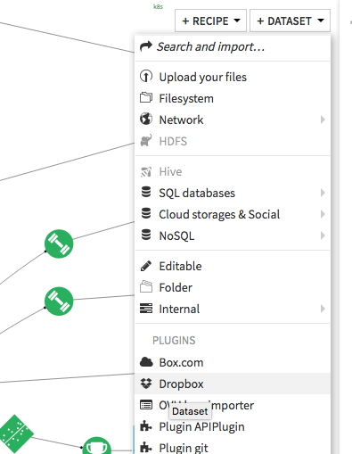
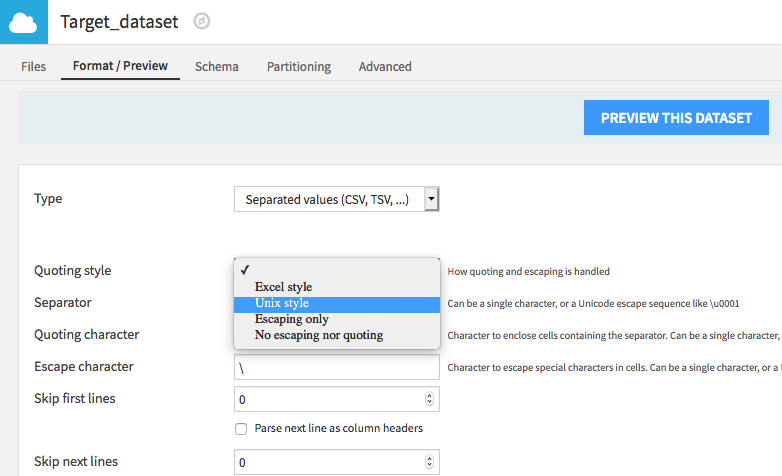
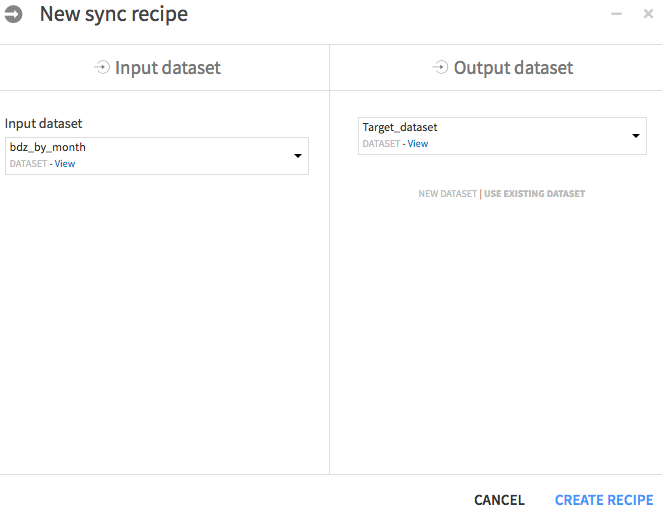

# dss-plugin-dropbox

This plugin provides a read and write connector to interact in your Dataiku DSS projects with csv documents stored on [Dropbox](https://www.dropbox.com).

## How to use

- Go to your [Dropbox's App Console](https://www.dropbox.com/developers/apps)
- Choose **Create app**
- Choose **Dropbox API**
- Set the permission type to **Full Dropbox** to give access to all the user's files or **App folder** to restrict the folders accessed by DSS.
- Name the app
- Click **Generate** in order to create the access token, and copy it
- In your DSS project flow, select **Dataset > Dropbox**

- Click Dropbox Filesystem
- In *Dropbox Access Token*, paste the previously copied token

## Write mode

- Edit the `DATADIR/config/dip.properties` file and add the following key: `dku.datasets.external.no_connection.allowClear=true`
- Share an empty directory with the Dropbox DSS app. It is important that it does not contain data you want to keep: **the entire structure contained inside this directory can be deleted by the plugin**.
- In the flow, first create your target Dropbox dataset, by selecting the Dropbox plugin in the dataset list.
- Browse to your target directory, name this new dataset and press **create**
- If the following message appears : `An invalid argument has been encountered : Missing parameters for CSV` got to the dataset *Settings > Format / Preview* and set *Quoting style*

- Pick the source dataset and create a sync recipe from it. Select *Use existing dataset* and pick your target Dropbox dataset. Finally **Create recipe**.

